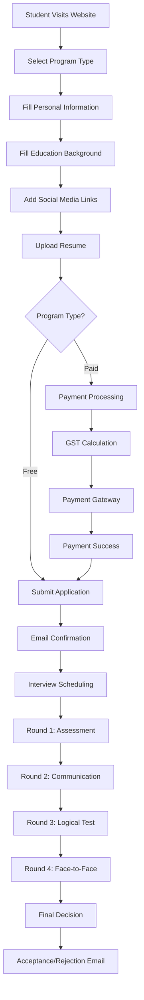
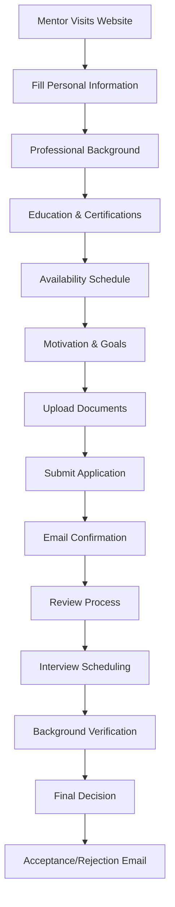

# TechAcademy - System Architecture Document

## 📋 Executive Summary

**Project:** TechAcademy - Modern Tech Education Platform  
**Version:** 1.0.0  
**Architecture Type:** Microservices-based Modern Web Application  
**Technology Stack:** React, Node.js, PostgreSQL, AWS Cloud Infrastructure

---

## 🎯 System Overview

TechAcademy is a comprehensive educational platform designed to bridge the gap between academic knowledge and industry requirements. The system supports multiple user types, course management, application processing, and corporate partnerships.

### Core Business Requirements
- **Student Applications:** Free and paid program applications with multi-step forms
- **Mentor Management:** Mentor recruitment and management system
- **Course Catalog:** Comprehensive course offerings with filtering and search
- **Corporate Partnerships:** Sponsorship and placement programs
- **Interview Process:** 4-round interview system (Assessment, Communication, Logical, Face-to-face)
- **Payment Processing:** GST calculation and payment integration
- **Document Management:** Resume and document upload handling

---

## 🏗️ System Architecture

### High-Level Architecture Diagram

```
┌─────────────────────────────────────────────────────────────────┐
│                        CLIENT LAYER                            │
├─────────────────────────────────────────────────────────────────┤
│  React SPA (Frontend)                                          │
│  ├── Public Pages (Home, About, Courses, Contact)              │
│  ├── Application Forms (Student, Mentor)                       │
│  ├── Admin Dashboard                                           │
│  └── Authentication & Authorization                            │
└─────────────────────────────────────────────────────────────────┘
                                │
                                │ HTTPS/REST API
                                ▼
┌─────────────────────────────────────────────────────────────────┐
│                      API GATEWAY LAYER                         │
├─────────────────────────────────────────────────────────────────┤
│  Nginx Reverse Proxy                                           │
│  ├── Load Balancing                                            │
│  ├── SSL Termination                                           │
│  ├── Rate Limiting                                             │
│  └── Request Routing                                           │
└─────────────────────────────────────────────────────────────────┘
                                │
                                │
                                ▼
┌─────────────────────────────────────────────────────────────────┐
│                    APPLICATION LAYER                           │
├─────────────────────────────────────────────────────────────────┤
│  Node.js/Express Backend Services                              │
│  ├── User Management Service                                   │
│  ├── Application Processing Service                            │
│  ├── Course Management Service                                 │
│  ├── Payment Processing Service                                │
│  ├── Email Notification Service                                │
│  ├── File Upload Service                                       │
│  └── Admin Dashboard Service                                   │
└─────────────────────────────────────────────────────────────────┘
                                │
                                │
                                ▼
┌─────────────────────────────────────────────────────────────────┐
│                      DATA LAYER                                │
├─────────────────────────────────────────────────────────────────┤
│  PostgreSQL Database                                           │
│  ├── User Management Tables                                    │
│  ├── Application Data Tables                                   │
│  ├── Course & Program Tables                                   │
│  ├── Payment & Transaction Tables                              │
│  └── Audit & Logging Tables                                    │
│                                                                │
│  File Storage (AWS S3)                                         │
│  ├── Resume & Document Storage                                 │
│  ├── Course Materials                                          │
│  └── Profile Images                                            │
└─────────────────────────────────────────────────────────────────┘
```

---

## 🔧 Component Architecture

### 1. Frontend Components (React SPA)

#### Core Components
```typescript
src/
├── components/
│   ├── Header.tsx              // Navigation & branding
│   ├── Footer.tsx              // Site links & contact info
│   ├── forms/
│   │   ├── ApplicationForm.tsx // Student application form
│   │   ├── MentorForm.tsx      // Mentor application form
│   │   └── ContactForm.tsx     // Contact inquiry form
│   ├── ui/
│   │   ├── Button.tsx          // Reusable button component
│   │   ├── Input.tsx           // Form input component
│   │   ├── Modal.tsx           // Modal dialog component
│   │   └── Card.tsx            // Content card component
│   └── layout/
│       ├── Layout.tsx          // Main layout wrapper
│       └── Sidebar.tsx         // Admin sidebar navigation
├── pages/
│   ├── Home.tsx                // Landing page
│   ├── Courses.tsx             // Course catalog
│   ├── ProgramApplication.tsx  // Student application
│   ├── MentorApplication.tsx   // Mentor application
│   ├── AdminDashboard.tsx      // Admin panel
│   └── [Other pages...]
├── services/
│   ├── api.ts                  // API client
│   ├── auth.ts                 // Authentication service
│   ├── emailService.ts         // Email notifications
│   └── fileUpload.ts           // File upload service
├── hooks/
│   ├── useAuth.ts              // Authentication hook
│   ├── useForm.ts              // Form management hook
│   └── useApi.ts               // API integration hook
└── types/
    ├── user.ts                 // User type definitions
    ├── application.ts          // Application types
    └── course.ts               // Course types
```

### 2. Backend Services (Node.js/Express)

#### Service Architecture
```typescript
backend/
├── src/
│   ├── controllers/
│   │   ├── userController.ts       // User management
│   │   ├── applicationController.ts // Application processing
│   │   ├── courseController.ts     // Course management
│   │   ├── paymentController.ts    // Payment processing
│   │   └── adminController.ts      // Admin operations
│   ├── services/
│   │   ├── userService.ts          // User business logic
│   │   ├── applicationService.ts   // Application workflow
│   │   ├── emailService.ts         // Email notifications
│   │   ├── fileService.ts          // File management
│   │   └── paymentService.ts       // Payment processing
│   ├── models/
│   │   ├── User.ts                 // User data model
│   │   ├── Application.ts          // Application model
│   │   ├── Course.ts               // Course model
│   │   └── Payment.ts              // Payment model
│   ├── middleware/
│   │   ├── auth.ts                 // Authentication middleware
│   │   ├── validation.ts           // Request validation
│   │   ├── upload.ts               // File upload middleware
│   │   └── rateLimit.ts            // Rate limiting
│   ├── routes/
│   │   ├── auth.ts                 // Authentication routes
│   │   ├── applications.ts         // Application routes
│   │   ├── courses.ts              // Course routes
│   │   ├── payments.ts             // Payment routes
│   │   └── admin.ts                // Admin routes
│   ├── utils/
│   │   ├── database.ts             // Database connection
│   │   ├── logger.ts               // Logging utility
│   │   ├── encryption.ts           // Data encryption
│   │   └── validation.ts           // Validation helpers
│   └── config/
│       ├── database.ts             // Database configuration
│       ├── aws.ts                  // AWS configuration
│       └── email.ts                // Email configuration
```

---

## 🗄️ Database Schema

### Core Entities

#### 1. Users Table
```sql
CREATE TABLE users (
    id UUID PRIMARY KEY DEFAULT gen_random_uuid(),
    email VARCHAR(255) UNIQUE NOT NULL,
    password_hash VARCHAR(255) NOT NULL,
    first_name VARCHAR(100) NOT NULL,
    last_name VARCHAR(100) NOT NULL,
    phone VARCHAR(20),
    role ENUM('student', 'mentor', 'admin') DEFAULT 'student',
    status ENUM('active', 'inactive', 'pending') DEFAULT 'pending',
    created_at TIMESTAMP DEFAULT CURRENT_TIMESTAMP,
    updated_at TIMESTAMP DEFAULT CURRENT_TIMESTAMP
);
```

#### 2. Student Applications Table
```sql
CREATE TABLE student_applications (
    id UUID PRIMARY KEY DEFAULT gen_random_uuid(),
    user_id UUID REFERENCES users(id),
    program_type ENUM('free', 'paid') NOT NULL,
    selected_program VARCHAR(100) NOT NULL,
    personal_info JSONB NOT NULL,
    education_info JSONB NOT NULL,
    social_media_info JSONB,
    resume_url VARCHAR(500),
    payment_info JSONB,
    application_status ENUM('submitted', 'under_review', 'interview_scheduled', 'accepted', 'rejected') DEFAULT 'submitted',
    interview_rounds JSONB DEFAULT '[]',
    created_at TIMESTAMP DEFAULT CURRENT_TIMESTAMP,
    updated_at TIMESTAMP DEFAULT CURRENT_TIMESTAMP
);
```

#### 3. Mentor Applications Table
```sql
CREATE TABLE mentor_applications (
    id UUID PRIMARY KEY DEFAULT gen_random_uuid(),
    user_id UUID REFERENCES users(id),
    personal_info JSONB NOT NULL,
    professional_info JSONB NOT NULL,
    education_info JSONB NOT NULL,
    availability_info JSONB NOT NULL,
    motivation_info JSONB NOT NULL,
    resume_url VARCHAR(500),
    cover_letter_url VARCHAR(500),
    application_status ENUM('submitted', 'under_review', 'interview_scheduled', 'accepted', 'rejected') DEFAULT 'submitted',
    created_at TIMESTAMP DEFAULT CURRENT_TIMESTAMP,
    updated_at TIMESTAMP DEFAULT CURRENT_TIMESTAMP
);
```

#### 4. Courses Table
```sql
CREATE TABLE courses (
    id UUID PRIMARY KEY DEFAULT gen_random_uuid(),
    title VARCHAR(200) NOT NULL,
    description TEXT NOT NULL,
    category VARCHAR(100) NOT NULL,
    duration_months INTEGER NOT NULL,
    price DECIMAL(10,2),
    is_free BOOLEAN DEFAULT FALSE,
    features JSONB DEFAULT '[]',
    prerequisites TEXT,
    learning_outcomes JSONB DEFAULT '[]',
    instructor_id UUID REFERENCES users(id),
    status ENUM('active', 'inactive', 'draft') DEFAULT 'draft',
    created_at TIMESTAMP DEFAULT CURRENT_TIMESTAMP,
    updated_at TIMESTAMP DEFAULT CURRENT_TIMESTAMP
);
```

#### 5. Payments Table
```sql
CREATE TABLE payments (
    id UUID PRIMARY KEY DEFAULT gen_random_uuid(),
    application_id UUID REFERENCES student_applications(id),
    amount DECIMAL(10,2) NOT NULL,
    gst_amount DECIMAL(10,2) NOT NULL,
    total_amount DECIMAL(10,2) NOT NULL,
    payment_method VARCHAR(50) NOT NULL,
    payment_status ENUM('pending', 'completed', 'failed', 'refunded') DEFAULT 'pending',
    transaction_id VARCHAR(255),
    payment_gateway_response JSONB,
    created_at TIMESTAMP DEFAULT CURRENT_TIMESTAMP,
    updated_at TIMESTAMP DEFAULT CURRENT_TIMESTAMP
);
```

#### 6. Interview Rounds Table
```sql
CREATE TABLE interview_rounds (
    id UUID PRIMARY KEY DEFAULT gen_random_uuid(),
    application_id UUID REFERENCES student_applications(id),
    round_number INTEGER NOT NULL,
    round_type ENUM('assessment', 'communication', 'logical', 'face_to_face') NOT NULL,
    scheduled_date TIMESTAMP,
    status ENUM('scheduled', 'completed', 'cancelled') DEFAULT 'scheduled',
    interviewer_id UUID REFERENCES users(id),
    score INTEGER,
    feedback TEXT,
    created_at TIMESTAMP DEFAULT CURRENT_TIMESTAMP,
    updated_at TIMESTAMP DEFAULT CURRENT_TIMESTAMP
);
```

---

## 🔌 API Endpoints

### Authentication Endpoints
```typescript
POST   /api/auth/register          // User registration
POST   /api/auth/login             // User login
POST   /api/auth/logout            // User logout
POST   /api/auth/refresh           // Refresh token
GET    /api/auth/profile           // Get user profile
PUT    /api/auth/profile           // Update user profile
```

### Application Endpoints
```typescript
POST   /api/applications/student   // Submit student application
GET    /api/applications/student   // Get student applications
PUT    /api/applications/student/:id // Update application
DELETE /api/applications/student/:id // Delete application

POST   /api/applications/mentor    // Submit mentor application
GET    /api/applications/mentor    // Get mentor applications
PUT    /api/applications/mentor/:id // Update mentor application
```

### Course Endpoints
```typescript
GET    /api/courses                // Get all courses
GET    /api/courses/:id            // Get course by ID
POST   /api/courses                // Create course (admin)
PUT    /api/courses/:id            // Update course (admin)
DELETE /api/courses/:id            // Delete course (admin)
GET    /api/courses/categories     // Get course categories
```

### Payment Endpoints
```typescript
POST   /api/payments/initiate      // Initiate payment
POST   /api/payments/verify        // Verify payment
GET    /api/payments/:id           // Get payment details
POST   /api/payments/refund        // Process refund
```

### Admin Endpoints
```typescript
GET    /api/admin/dashboard        // Admin dashboard data
GET    /api/admin/applications     // All applications
PUT    /api/admin/applications/:id/status // Update application status
GET    /api/admin/analytics        // System analytics
GET    /api/admin/users            // User management
```

### File Upload Endpoints
```typescript
POST   /api/upload/resume          // Upload resume
POST   /api/upload/documents       // Upload documents
GET    /api/files/:id              // Download file
DELETE /api/files/:id              // Delete file
```

---

## 🔄 Application Workflow

### Student Application Process


### Mentor Application Process


---

## 🛡️ Security Architecture

### Authentication & Authorization
- **JWT Tokens:** Stateless authentication with refresh tokens
- **Role-Based Access Control (RBAC):** Student, Mentor, Admin roles
- **Password Security:** bcrypt hashing with salt rounds
- **Session Management:** Secure session handling with expiration

### Data Protection
- **Encryption at Rest:** Database encryption for sensitive data
- **Encryption in Transit:** HTTPS/TLS for all communications
- **PII Protection:** Personal data encryption and anonymization
- **GDPR Compliance:** Data retention and deletion policies

### API Security
- **Rate Limiting:** Prevent abuse and DDoS attacks
- **Input Validation:** Comprehensive request validation
- **CORS Configuration:** Secure cross-origin requests
- **API Versioning:** Backward compatibility and security updates

---

## ☁️ Cloud Infrastructure (AWS)

### Infrastructure Components
```yaml
# AWS Services Used
EC2:
  - Application servers (Auto Scaling Group)
  - Load balancers (ALB)
  - Bastion hosts for secure access

RDS:
  - PostgreSQL database (Multi-AZ)
  - Automated backups
  - Read replicas for scaling

S3:
  - File storage (resumes, documents)
  - Static website hosting
  - CloudFront CDN integration

CloudWatch:
  - Application monitoring
  - Log aggregation
  - Performance metrics

Route 53:
  - DNS management
  - Health checks
  - Failover routing

Certificate Manager:
  - SSL/TLS certificates
  - Automatic renewal

SES:
  - Email notifications
  - Transactional emails
  - Bounce handling
```

### Deployment Architecture
```yaml
# Production Environment
Environment: Production
Region: us-west-2 (Oregon)
Availability Zones: 3 (Multi-AZ)

Frontend:
  - S3 + CloudFront (Static hosting)
  - Route 53 (DNS)
  - Certificate Manager (SSL)

Backend:
  - EC2 Auto Scaling Group (2-10 instances)
  - Application Load Balancer
  - RDS PostgreSQL (Multi-AZ)
  - ElastiCache (Redis for sessions)

Storage:
  - S3 (File storage)
  - EBS (Database storage)
  - CloudWatch Logs

Security:
  - VPC with private subnets
  - Security Groups
  - IAM roles and policies
  - WAF (Web Application Firewall)
```

---

## 📊 Monitoring & Logging

### Application Monitoring
- **Health Checks:** Automated health monitoring
- **Performance Metrics:** Response times, throughput
- **Error Tracking:** Exception monitoring and alerting
- **User Analytics:** Usage patterns and behavior

### Infrastructure Monitoring
- **Server Metrics:** CPU, memory, disk usage
- **Database Performance:** Query performance, connections
- **Network Monitoring:** Bandwidth, latency
- **Security Monitoring:** Failed login attempts, suspicious activity

### Logging Strategy
```typescript
// Log Levels
ERROR: System errors, exceptions
WARN:  Warning conditions
INFO:  General information
DEBUG: Detailed debugging information

// Log Categories
Application: Business logic logs
Security: Authentication, authorization
Performance: Response times, database queries
Audit: User actions, data changes
```

---

## 🚀 Deployment Strategy

### CI/CD Pipeline
```yaml
# GitHub Actions Workflow
name: Deploy TechAcademy
on:
  push:
    branches: [main]

jobs:
  test:
    runs-on: ubuntu-latest
    steps:
      - uses: actions/checkout@v2
      - name: Run tests
        run: npm test

  build:
    needs: test
    runs-on: ubuntu-latest
    steps:
      - name: Build application
        run: npm run build

  deploy:
    needs: build
    runs-on: ubuntu-latest
    steps:
      - name: Deploy to AWS
        run: ./deploy.sh
```

### Environment Strategy
- **Development:** Local development environment
- **Staging:** Pre-production testing environment
- **Production:** Live production environment

### Rollback Strategy
- **Database Migrations:** Reversible migration scripts
- **Application Rollback:** Blue-green deployment
- **Infrastructure Rollback:** Infrastructure as Code (Terraform)

---

## 📈 Scalability Considerations

### Horizontal Scaling
- **Load Balancing:** Multiple application instances
- **Database Scaling:** Read replicas, connection pooling
- **CDN:** Global content delivery
- **Microservices:** Service decomposition for independent scaling

### Performance Optimization
- **Caching:** Redis for session and data caching
- **Database Optimization:** Indexing, query optimization
- **Frontend Optimization:** Code splitting, lazy loading
- **Image Optimization:** WebP format, responsive images

### Capacity Planning
- **Traffic Analysis:** Expected user load
- **Resource Monitoring:** CPU, memory, storage usage
- **Auto Scaling:** Dynamic resource allocation
- **Cost Optimization:** Right-sizing instances

---

## 🔮 Future Enhancements

### Phase 2 Features
- **Video Streaming:** Course video content delivery
- **Live Classes:** Real-time virtual classrooms
- **Progress Tracking:** Student learning analytics
- **Certificate Generation:** Automated certificate creation
- **Mobile App:** Native mobile applications

### Phase 3 Features
- **AI-Powered Recommendations:** Personalized course suggestions
- **Chatbot Support:** Automated customer support
- **Advanced Analytics:** Business intelligence dashboard
- **Integration APIs:** Third-party system integrations
- **Multi-language Support:** Internationalization

---

## 📋 Implementation Roadmap

### Phase 1: Core Platform (Weeks 1-8)
- ✅ Frontend development (React SPA)
- ✅ Basic backend API (Node.js/Express)
- ✅ Database schema implementation
- ✅ User authentication system
- ✅ Application forms (Student & Mentor)
- ✅ Basic admin dashboard

### Phase 2: Advanced Features (Weeks 9-16)
- 🔄 Payment integration
- 🔄 Email notification system
- 🔄 File upload and management
- 🔄 Interview scheduling system
- 🔄 Advanced admin features
- 🔄 Security hardening

### Phase 3: Production Deployment (Weeks 17-20)
- 🔄 AWS infrastructure setup
- 🔄 CI/CD pipeline implementation
- 🔄 Monitoring and logging
- 🔄 Performance optimization
- 🔄 Security audit and testing
- 🔄 Production deployment

### Phase 4: Enhancement & Scaling (Weeks 21+)
- 🔄 Advanced features implementation
- 🔄 Performance optimization
- 🔄 User feedback integration
- 🔄 Continuous improvement
- 🔄 Feature expansion

---

## 📞 Support & Maintenance

### Development Team Structure
- **Frontend Developer:** React/TypeScript development
- **Backend Developer:** Node.js/API development
- **DevOps Engineer:** Infrastructure and deployment
- **QA Engineer:** Testing and quality assurance
- **Product Manager:** Requirements and coordination

### Maintenance Schedule
- **Daily:** System health monitoring
- **Weekly:** Performance review and optimization
- **Monthly:** Security updates and patches
- **Quarterly:** Feature updates and enhancements
- **Annually:** Architecture review and planning

---

*This architecture document serves as the foundation for the TechAcademy platform development and should be updated as the system evolves.*

